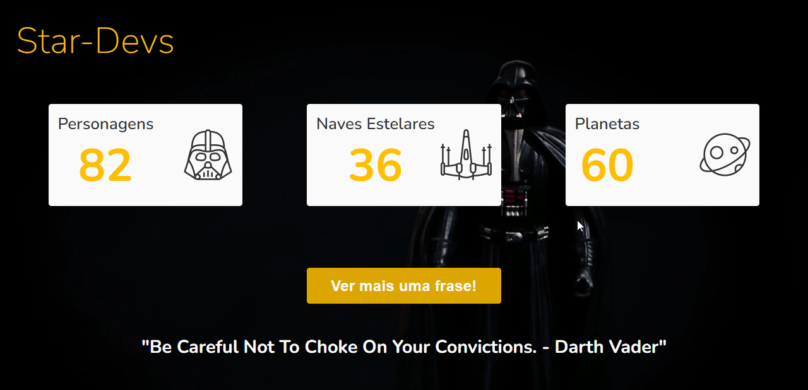

<h1 align="center">Star Devs</h1>

<i> Consumo de API Publica do Star Wars utilizando Javascript puro e mostrando os dados para o usuário</i>

<h1 align="center">
    
</h1>
 

<h4 align="center"> 
    :construction:  StarDevs ⭐👨‍💻 Concluído  :construction:
</h4>

## 🚀 Tecnologias

Esse projeto foi desenvolvido com as seguintes tecnologias:

- HTML
- CSS
- JavaScript

### Utilitarios

 - API: [Swapi.dev](https://swapi.dev/api/),     [SwaggerRandomStarWarsQuote](https://swquotesapi.digitaljedi.dk/api/SWQuote/RandomStarWarsQuote)
-  Editor: [Visual Studio Code](https://code.visualstudio.com/)
-  Fontes:  [Nunito](https://fonts.google.com/specimen/Nunito)

